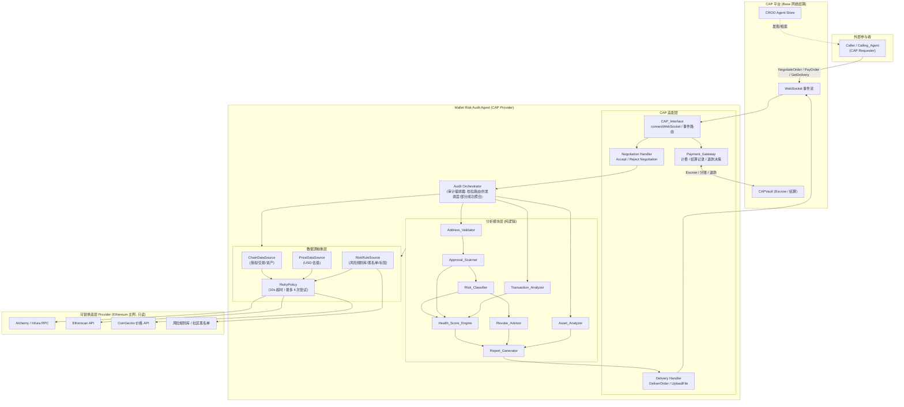
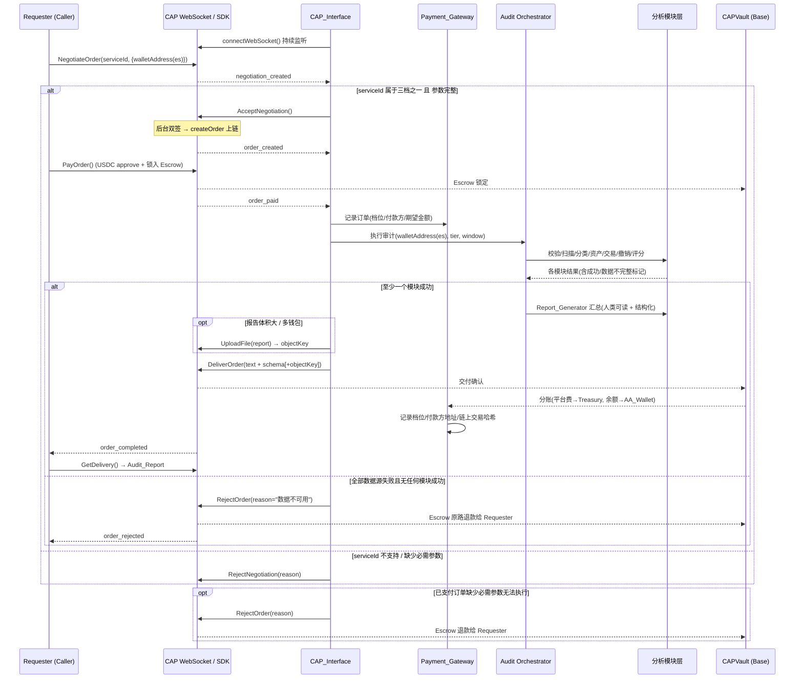

# 设计文档：钱包风险体检 Agent（Wallet Risk Audit Agent）

## Overview

> 概述

钱包风险体检 Agent 是一个**只读**的链上安全分析服务：调用方（人类用户或其他 Agent）提交一个或多个钱包地址，本 Agent 通过公开链上数据扫描该钱包的授权情况、合约风险、交互历史与资产分布，输出一份包含**钱包健康评分（Health_Score）**的安全报告。本服务面向 CROO Agent Hackathon（赛道：DeFi / On-chain Ops Agents）构建，在 **CAP（CROO Agent Protocol）** 中担任 **Provider** 角色，通过 USDC 按次付费被人类与其他 Agent 调用并在链上结算。

### 设计目标

1. **两条链严格区分**：本设计始终区分两条互相独立的链。
   - **被审计链（Audited_Chain）= Ethereum 主网**：所有链上数据读取（授权、交易、资产、价格）都发生在 Ethereum 主网，**只读**。
   - **结算链（Settlement Chain）= Base 网络**：CAP 订单的 USDC 付费、Escrow 托管与分账结算固定发生在 Base 网络，由 CAP 平台与 CAPVault 处理，本 Agent 不直接操作结算链，链上 gas 全部由 CROO 平台代付。
   - 两条链没有任何资金或签名通路交叉。被审计链只读、结算链由 CAP SDK 托管。

2. **架构上无私钥/签名路径（核心安全卖点，对应 Requirement 13 / H5）**：整个系统不存在任何接收、存储、使用私钥或助记词的代码路径，也不存在代用户发起交易的代码路径。撤销建议仅产出 `Revoke_Link`，由用户在自有钱包中自行确认执行。

3. **确定性与可测试性**：核心分析逻辑（地址校验、授权判定、风险分类、资产分布、健康评分、报告序列化）设计为**纯函数**，对相同输入产生相同输出，便于使用 property-based testing（PBT）验证正确性属性。

4. **数据源可替换 + 健壮性**：所有链上数据获取通过统一的数据源抽象层（Data Source Abstraction Layer）进行，支持替换底层 Provider（Etherscan / Alchemy / Infura / 公共 RPC / CoinGecko 价格源等），并内置统一的超时（10s）与重试（最多 3 次重试、含首次共 4 次尝试）策略（对应 Requirement 18）。

5. **部分成功计费、全失败退款**：至少一个分析模块成功即按档位足额结算；全部数据源失败且无任何模块成功则拒单退款（对应 Requirement 18.4 / 18.5、H6）。

### 技术选型

| 维度 | 选型 | 理由 |
|------|------|------|
| 运行时 / 语言 | **Node.js + TypeScript** | CAP SDK 的 Node 实现 `@croo-network/sdk` 为一等公民；EVM 数据生态在 Node 上最丰富；TypeScript 的静态类型对"结构化交付物 + schema 版本"约束有直接帮助；单语言覆盖 CAP 集成、链上数据、报告生成全链路，黑客松开发效率高 |
| CAP SDK | `@croo-network/sdk`（`AgentClient`） | 协议要求的唯一客户端，`X-SDK-Key` 鉴权 |
| EVM 数据读取 | `viem`（RPC/合约只读调用）+ Alchemy / Etherscan REST | `viem` 类型安全、只读调用语义清晰；Alchemy 提供 token allowance/balance/交易历史聚合 API；Etherscan 提供合约验证状态、内部交易、合约部署时间 |
| 价格源 | CoinGecko（默认）经价格源抽象 | 提供 ERC-20 / 原生代币 USD 估值；通过抽象层可替换 |
| PBT 测试库 | **fast-check** | Node 生态最成熟的 property-based testing 库，与 Vitest/Jest 集成良好，支持 `numRuns` 配置≥100 次迭代与最小化反例 |
| 单元/集成测试 | Vitest | 快速、原生支持 TypeScript、与 fast-check 集成顺畅 |

> 说明：CAP SDK 同时提供 Go / Node.js / Python 三种等价实现。本设计选定 Node.js/TypeScript 后，所有 CAP 方法名（`AcceptNegotiation`、`RejectNegotiation`、`PayOrder`、`DeliverOrder`、`RejectOrder`、`GetDelivery`、`UploadFile`、`GetDownloadURL`、`connectWebSocket`、`listOrders`、`listNegotiations`）均严格依据 `docs/cap-protocol.md`，不臆造任何 API。

---

## Architecture

> 架构

系统分为四层：**CAP 适配层（Provider）**、**审计编排器（Audit Orchestrator）**、**分析模块层（Analysis Modules）**、**数据源抽象层（Data Source Abstraction Layer）**。支付/结算网关（Payment_Gateway）横跨 CAP 适配层，负责把 CAP 订单生命周期与计费/结算/退款决策衔接起来。



### 层职责

- **CAP 适配层**：持有 `AgentClient`，建立并维持 WebSocket 连接（自动重连由 SDK 负责），把 `negotiation_created`/`order_paid`/`order_rejected`/`order_expired` 事件路由到对应处理器。仅此层依赖 CAP SDK，分析模块层完全与 CAP 解耦。
- **审计编排器**：根据订单档位（Quick/Full/Multi）决定调用哪些模块、并发调度模块、收集部分成功结果、把数据源不可用状态传播给 `Report_Generator` 与 `Payment_Gateway`。
- **分析模块层**：全部为纯逻辑组件。数据获取通过注入的数据源抽象接口完成，模块内部不直接发起网络请求，从而可被 PBT 用内存假数据驱动。
- **数据源抽象层**：定义 `ChainDataSource` / `PriceDataSource` / `RiskRuleSource` 三个接口与统一 `RetryPolicy`。底层 Provider 实现可替换；测试时用 Mock 实现替换。

---

## CAP 集成设计

本 Agent 在 CAP 中是 Provider。核心运行循环依据 `docs/cap-protocol.md` 第 6 节实现。三个付费档位对应三个独立 CAP Service：

| 档位 | 名称 | 价格 | Service_ID（部署期由 Dashboard 生成并写入配置） | 交付物 |
|------|------|------|------------------------------------------------|--------|
| Quick_Checkup_Tier | 快速体检 | 0.5 USDC | `SERVICE_ID_QUICK` | Health_Score + Unlimited_Approval + High_Risk_Contract 精简报告 |
| Full_Report_Tier | 完整报告 | 2 USDC | `SERVICE_ID_FULL` | 全部分析模块结果 |
| Multi_Wallet_Tier | 多钱包+历史 | 5 USDC | `SERVICE_ID_MULTI` | 多钱包汇总报告 + 更长历史窗口 |

> Service_ID 在 Dashboard 配置 Service 后派生（属于人工介入前置条件，见末尾「部署与人工介入」），运行时通过环境变量/配置注入，代码以 `serviceId → tier` 的映射表识别档位。

### Provider 事件循环时序图



### 交付物双形态

每份 `Audit_Report` 同时交付**人类可读形式（text）**与**机器可读结构化形式（schema）**（对应 Requirement 14.6/14.7、5.1/5.2、H3）：

- **人类可读形式**：Markdown 文本，含分节标题、健康评分与定性等级、风险项列表、撤销建议、只读声明。通过 `DeliverOrder` 的 text 字段交付（大报告/多钱包先 `UploadFile` 得到 objectKey，再放进交付数据，由 Requester 用 `GetDownloadURL` 取 30 分钟有效期链接）。
- **机器可读结构化形式**：JSON，符合下文「数据模型」定义的 `AuditReportStructured` schema，**必含** `schemaVersion`（结构版本标识）与 `riskLevelSummary`（机器可读 Risk_Level 汇总字段），供 Calling_Agent 解析决策。

---

## Components and Interfaces

> 组件与接口

所有分析模块以 TypeScript 接口定义，输入/输出均为可序列化的纯数据结构。数据源以依赖注入方式传入，模块内部不直接访问网络。

### 数据源抽象接口

```typescript
// 被审计链 = Ethereum 主网，全部只读
interface ChainDataSource {
  getApprovals(addr: Address): Promise<RawApproval[]>;        // ERC-20 allowance / setApprovalForAll / Permit2
  getTransactions(addr: Address, windowDays: number): Promise<RawTransaction[]>; // ≤1000 笔
  getInternalTxs(addr: Address, windowDays: number): Promise<RawInternalTx[]>;
  getBalances(addr: Address): Promise<RawBalance[]>;          // 原生 + ERC-20，不含 NFT
  getContractMeta(contract: Address): Promise<ContractMeta>;  // 是否开源/部署时间/历史交易数
}

interface PriceDataSource {
  getUsdPrices(tokens: Address[]): Promise<Map<Address, UsdPrice>>; // 含来源名与取价时间
}

interface RiskRuleSource {
  lookup(contract: Address): Promise<RiskRuleEntry>; // 黑名单/钓鱼/盗币标记 + 可读标签
}

// 统一重试/超时策略 (Requirement 18)
interface RetryPolicy {
  // 单次请求 10s 超时；失败最多重试 3 次（含首次共 4 次尝试）；全失败抛 DataSourceUnavailable
  run<T>(op: () => Promise<T>, label: string): Promise<T>;
}
```

### 分析模块

| 组件 | 输入 | 输出 | 关键判定规则（对齐需求阈值） |
|------|------|------|------------------------------|
| **Address_Validator** | 原始地址字符串数组、档位 | `ValidatedAddress[]`（含每地址校验结果） | 格式 `^0x[0-9a-fA-F]{40}$`（大小写不敏感，全小写/全大写/EIP-55 校验和形式均有效）；空/空白/缺失拒绝；逐地址独立校验；去重保留一个；单次 >50 拒绝；非 Ethereum 网络 → "暂不支持该网络"（Req 1、17.2） |
| **Approval_Scanner** | `Address`、`ChainDataSource` | `ApprovalRecord[]` 或失败结果 | ERC-20 allowance ≥ `2^255` → `Unlimited_Approval`；`setApprovalForAll==true` → `Unlimited_Approval`；每条列出代币合约、被授权方、可读标签（无标签="未知"）、最近更新时间戳；无授权 → "无授权记录"；超时/不可用 → 失败结果且保留上次成功数据（Req 6） |
| **Risk_Classifier** | `ApprovalRecord[]`、交易交互对象、`RiskRuleSource`、`ContractMeta` | 每个被授权合约的 `Risk_Level` 与命中特征 | 6 项可疑特征 (a)未开源 (b)部署<30天 (c)历史交易<100 (d)无审计 (e)命中黑名单 (f)spender 为 EOA；命中 ≥2 项 → 从 `Suspicious_Contract` 升级为 `High_Risk_Contract`；列出全部命中特征作为原因；规则库不可达 → 不可用结果且不覆盖上次（Req 7、8.2、8.3） |
| **Asset_Analyzer** | `RawBalance[]`、`PriceDataSource` | `AssetDistribution` | 原生+ERC-20（不含 NFT）；按 USD 估值降序取 Top 10，其余并入"其他"；各项+"其他"百分比保留 2 位、合计=100%；标 USD 单位、价格来源名与取价时间；无法估值 → "估值不可用"并从总值与百分比中排除；<$1 视为垃圾代币归入"其他"；无 ≥$1 资产 → "无可显示资产"（Req 9） |
| **Transaction_Analyzer** | `RawTransaction[]`、`RawInternalTx[]`、窗口天数 | 高风险交互列表 + 失败/异常交易列表 | 窗口默认 90 天（可配 1–365），最多 1000 笔；高风险交互含"直接交互"与"内部调用"，按时间从新到旧最多 100 笔（hash/合约/UTC 时间/类型）；失败交易=链上回滚；5 类异常：(a)粉尘<$1 (b)零金额地址投毒(首尾4字符相同) (c)向风险名单转出 (d)失败交易 Gas >窗口内失败交易 Gas 中位数 3 倍 (e)与部署<7天合约交互；从新到旧列出（Req 8、10、15.2） |
| **Revoke_Advisor** | 已分类授权项 | 排序后的 `RevokeAdvice[]` | 为每个 `Unlimited_Approval`/`Suspicious_Contract`/`High_Risk_Contract` 各生成一条建议与 `Revoke_Link`（含被授权合约、代币合约、链参数=Ethereum）；排序固定 CRITICAL→HIGH→MEDIUM→LOW，同级按授权额度降序；标类别+Risk_Level 作为原因；ERC-721 setApprovalForAll → 以操作员地址+NFT 合约为参数的链接；无可撤销 → "无需撤销的授权"（Req 11） |
| **Health_Score_Engine** | 全部风险项集合（类别+Risk_Level）+ 完成模块集合 | 0–100 整数 + 定性等级 + 扣分明细 | 基于授权/合约/交易风险计算；100=无风险；列出每个风险项及扣分贡献降序；无风险 → 80–100；相同输入 → 相同分（确定性）；风险更多/更高一方分数 ≤ 另一方（单调性）；等级 80–100 优 / 60–79 良 / 40–59 中 / 0–39 差；部分数据 → 仅按已完成模块计算并标注"基于不完整数据"（Req 12） |
| **Report_Generator** | 各模块结果、档位、链名、UTC 时间 | `AuditReport`（text + structured） | 汇总为报告；Quick=仅 Health_Score + Unlimited + High_Risk；Full=全部模块；标 Wallet_Address/Audited_Chain/UTC 生成时间；同时输出人类可读与结构化形式；结构化形式含 `riskLevelSummary` 与 `schemaVersion`；含只读声明（Req 14、15.3/15.4、13.4） |
| **Payment_Gateway** | CAP 订单上下文、模块成功情况 | 计费/结算/退款决策、结算记录 | 三档=三独立 Service；交付前要求 PayOrder；USDC on Base 结算；0.5/2/5 USDC；Escrow 未锁定→拒绝交付；结算记录档位/付款方地址/链上交易哈希；gas 由平台代付；≥1 模块成功→足额结算；全失败→RejectOrder 退款（Req 4、5.3、18.4/18.5） |

### 健康评分模型（确定性 + 单调性的可实现定义）

为同时满足确定性（Req 12.4）与单调性（Req 12.5），评分定义为风险项集合上的**纯加性扣分函数**：

```
weight(Risk_Level): CRITICAL=40, HIGH=25, MEDIUM=12, LOW=4   (单调非增于等级，CRITICAL≥HIGH≥MEDIUM≥LOW)
deduction(report) = Σ weight(item.riskLevel)  对该报告作用域内全部已识别风险项求和
Health_Score = max(0, 100 - deduction)
```

- **确定性**：纯函数，仅依赖风险项集合（与顺序无关，先对风险项规范排序后求和）。
- **单调性**：扣分恒为非负且可加，加入风险项只会增大扣分；把某项 Risk_Level 提升只会增大其权重；`max(0, …)` 截断保持"不高于"关系（允许相等）。
- **无风险**：扣分=0 → 分数=100，落入 80–100 区间（Req 12.3）。
- **部分数据**：仅对"已完成模块"产生的风险项求和，并在报告标注"基于不完整数据"（Req 12.7）。

---

## Data Models

> 数据模型

以下为机器可读结构化形式（JSON）的核心类型定义。`schemaVersion` 用于标识结构版本，便于 A2A 消费方做兼容处理。

```typescript
type RiskLevel = "LOW" | "MEDIUM" | "HIGH" | "CRITICAL";
type Tier = "QUICK" | "FULL" | "MULTI";
type ApprovalKind = "ERC20" | "ERC721_OPERATOR" | "ERC1155_OPERATOR" | "PERMIT2";

interface ApprovalRecord {
  tokenContract: Address;          // 代币合约地址
  spender: Address;                // 被授权方
  spenderLabel: string;            // 可读标签，无标签为 "未知"
  kind: ApprovalKind;
  allowance: string;               // uint256 十进制字符串（避免精度丢失）
  isUnlimited: boolean;            // ERC20 allowance ≥ 2^255 或 setApprovalForAll==true
  lastUpdated: string;             // ISO-8601 UTC
}

interface ContractRisk {
  contract: Address;
  riskLevel: RiskLevel;
  classification: ("SUSPICIOUS" | "HIGH_RISK")[]; // 命中标记
  matchedFeatures: string[];       // 命中的可疑特征 (a)-(f)
}

interface AssetItem {
  token: Address | "NATIVE";
  symbol: string;
  balance: string;                 // 十进制字符串
  usdValue: number | null;         // null = 估值不可用
  percentage: number | null;       // 保留两位小数；估值不可用为 null
}
interface AssetDistribution {
  unit: "USD";
  priceSource: string;             // 价格来源名
  pricedAt: string;                // 取价时间 UTC
  top: AssetItem[];                // 最多 10 项
  other: AssetItem | null;         // "其他" 合并项
  empty: boolean;                  // true = "无可显示资产"
}

interface TxFinding {
  txHash: string;
  timestamp: string;               // UTC
  reason: string;                  // 失败 / 粉尘 / 地址投毒 / 风险转出 / 高 Gas 失败 / 新合约
  interactionType?: "DIRECT" | "INTERNAL";
  contract?: Address;
}

interface RevokeAdvice {
  category: "UNLIMITED_APPROVAL" | "SUSPICIOUS_CONTRACT" | "HIGH_RISK_CONTRACT";
  riskLevel: RiskLevel;
  reason: string;
  revokeLink: RevokeLink;
  allowance: string;               // 排序依据（操作员授权类无额度时为标记值）
}
interface RevokeLink {
  chain: "ethereum-mainnet";       // 被审计链参数，独立于结算链
  tokenContract: Address;
  spenderOrOperator: Address;
  approvalKind: ApprovalKind;
  url: string;                     // 可点击撤销链接
}

interface ModuleStatus {
  module: string;
  status: "OK" | "INCOMPLETE" | "FAILED";
  unavailableSource?: string;      // 导致不完整的数据源
}

interface AuditReportStructured {
  schemaVersion: string;           // 例如 "1.0.0" —— 结构版本标识 (Req 14.7)
  walletAddress: Address;
  auditedChain: "Ethereum Mainnet";// 被审计链 (Req 14.5/17)
  generatedAt: string;             // UTC
  tier: Tier;
  readOnlyDeclaration: string;     // 只读 & 从不接触私钥声明 (Req 13.4)
  healthScore: number;             // 0..100
  healthGrade: "优" | "良" | "中" | "差";
  riskLevelSummary: RiskLevel;     // 机器可读风险汇总字段 (Req 5.2/14.7)
  scoredOnIncompleteData: boolean; // (Req 12.7)
  approvals: ApprovalRecord[];
  contractRisks: ContractRisk[];
  assets: AssetDistribution;
  txFindings: TxFinding[];
  revokeAdvice: RevokeAdvice[];
  moduleStatuses: ModuleStatus[];
}

// 多钱包 (Multi_Wallet_Tier)
interface MultiWalletReport {
  schemaVersion: string;
  walletCount: number;             // (Req 15.4)
  reports: AuditReportStructured[];
}

// CAP 订单上下文（适配层内部）
interface OrderContext {
  orderId: string;
  serviceId: string;
  tier: Tier;
  payerAddress: Address;           // 付款方 (Base 上 AA 钱包)
  walletAddresses: Address[];      // 被审计地址 (Ethereum)
  status: "PAID" | "DELIVERED" | "REJECTED";
}

// 结算记录 (Req 4.10 / 6.2)
interface SettlementRecord {
  orderId: string;
  tier: Tier;
  payerAddress: Address;
  settlementTxHash: string;        // Base 链上交易哈希
  amountUsdc: number;              // 0.5 / 2 / 5
}
```

---

## 数据源抽象与错误处理

### 重试与超时（Requirement 18.1/18.2）

`RetryPolicy.run` 对每次数据源调用施加：
- 单次请求 **10 秒超时**；
- 失败（超时或错误）后自动重试，**最多 3 次重试**（含首次共 **4 次尝试**）；
- 4 次尝试均失败 → 抛出 `DataSourceUnavailable(sourceName)`，由编排器捕获并把对应模块标记为 `INCOMPLETE`/`FAILED`，记录 `unavailableSource`。

### 部分成功计费（Requirement 18.3/18.4，H6-3）

编排器收集每个模块的 `ModuleStatus`：
- 至少一个模块 `OK` → `Report_Generator` 生成报告（不可用模块标 "数据不完整"，并由 `Health_Score_Engine` 仅按已完成模块评分、标注基于不完整数据）→ `DeliverOrder` → CAPVault 按档位**足额结算**。
- 全部模块失败（所有数据源在各自 4 次尝试后均不可用，无任何模块成功）→ `CAP_Interface` 调 `RejectOrder(reason)` → CAPVault 把 Escrow 退还 Requester（Requirement 18.5）。

### 单模块数据保留（Requirement 6.6 / 7.6）

`Approval_Scanner` 与 `Risk_Classifier` 在数据源/规则库不可用时返回失败结果，但**不覆盖**该 `Wallet_Address` 上一次成功扫描/分类的缓存数据（保留上次成功结果不被覆盖）。

### CAP 错误处理（依据 cap-protocol.md 3.4）

CAP SDK 抛 `APIError(code, reason, message)`，配合 `isNotFound` / `isUnauthorized` / `isInsufficientBalance` 判断；所有可重试操作具备幂等保护，重复调用安全。`DeliverOrder`/`RejectOrder` 在重连后可安全重试。


---

## Correctness Properties

> 正确性属性

*属性（property）是指在系统所有有效执行中都应成立的特征或行为——本质上是对系统应当做什么的形式化陈述。属性在人类可读的规格说明与机器可验证的正确性保证之间架起桥梁。*

下列属性均为**全称量化**陈述（"对任意…"），来源于上文 prework 分析并经冗余消解。每条标注其验证的需求条目，将以 property-based testing 实现（fast-check，每条 ≥100 次迭代）。地址校验、授权判定、风险分类、资产分布、健康评分、撤销排序、报告序列化均为纯函数，适合 PBT；CAP/CAPVault 等外部服务行为不在本节范围（见测试策略的集成/冒烟测试）。

### Property 1: 地址格式校验正确性

*对任意* 字符串，当且仅当它以 `0x` 开头、其后紧跟恰好 40 个十六进制字符（大小写不敏感）、总长 42 时，Address_Validator 判定其格式有效；任何不满足者均被拒绝并返回指明原因的提示，且不产生待分析记录。

**Validates: Requirements 1.1, 1.2, 1.4**

### Property 2: 批量校验等价于逐个校验且去重幂等

*对任意* 钱包地址列表，批量校验对每个地址给出的结果，与单独校验该地址的结果一致；且对包含重复地址的列表去重后，输出地址互不重复并等于输入的去重集合。

**Validates: Requirements 1.5, 1.7**

### Property 3: 协商决策正确性

*对任意* 协商请求（serviceId 与参数完整性），当且仅当 serviceId 属于本 Agent 已配置的三档之一且必需参数完整时，决策为 AcceptNegotiation；否则决策为 RejectNegotiation 并附原因。

**Validates: Requirements 2.2, 2.6**

### Property 4: 无限授权判定

*对任意* 授权记录，当且仅当（ERC-20 allowance ≥ 2^255）或（ERC-721/ERC-1155 的 setApprovalForAll 为 true）时，该记录被标记为 Unlimited_Approval。

**Validates: Requirements 6.2, 6.3**

### Property 5: 授权记录字段完整性

*对任意* Unlimited_Approval 记录，输出均包含代币合约地址、被授权方地址、被授权方可读标签（无标签时为"未知"）与最近一次更新时间戳四项。

**Validates: Requirements 6.4**

### Property 6: 可疑/高风险合约分级与原因

*对任意* 被授权合约及其特征集合（6 项可疑特征的任意子集），命中 0 项不标记，命中恰 1 项标记为 Suspicious_Contract，命中 ≥2 项升级为 High_Risk_Contract；且输出的 matchedFeatures 恰等于实际命中的特征集合，每个被授权合约都获得一个合法的 Risk_Level 枚举值。

**Validates: Requirements 7.1, 7.2, 7.3, 7.4, 7.5**

### Property 7: 数据源/规则库失败不覆盖上次成功结果

*对任意* 钱包地址，若其存在上一次成功的授权扫描或合约分类结果，则当本次数据源或规则库不可用时，返回失败结果但该地址上一次成功的数据保持不变、不被覆盖。

**Validates: Requirements 6.6, 7.6**

### Property 8: 高风险交互标记与交互类型

*对任意* 交易，若其直接交互对象命中 High_Risk_Contract 则标记为高风险交互且类型为"直接交互"；若其内部调用交互对象命中 High_Risk_Contract 则标记为高风险交互且类型为"内部调用"。

**Validates: Requirements 8.2, 8.3**

### Property 9: 交易窗口、上限、排序与字段完整性

*对任意* 交易集合与时间窗口，分析结果中的交易均落在该窗口内且数量不超过 1000 笔；输出的高风险交互与失败/异常交易均按交易时间从新到旧排序，高风险交互不超过 100 笔，且每笔包含交易哈希、UTC 时间、被标记原因（高风险交互另含交互类型）。

**Validates: Requirements 8.1, 8.4, 10.3**

### Property 10: 失败与异常交易识别

*对任意* 交易，当且仅当其链上执行状态为失败（回滚）时被识别为失败交易；当且仅当其命中五类异常特征之一（粉尘 <$1、零金额且对方地址与历史交互地址首尾 4 字符均相同的地址投毒、向风险名单地址转出、失败交易 Gas 超过窗口内失败交易 Gas 中位数 3 倍、与部署不足 7 天的合约交互）时被标记为异常交易。

**Validates: Requirements 10.1, 10.2**

### Property 11: 交易分析拒绝无效地址

*对任意* 格式无效的钱包地址，Transaction_Analyzer 拒绝该请求并返回指示地址格式无效的错误结果，且不返回任何交易分析数据。

**Validates: Requirements 10.5**

### Property 12: 资产分布不变量

*对任意* 资产余额集合，资产分布结果仅包含原生代币与 ERC-20（不含 NFT），按 USD 估值从高到低排序、主要资产不超过 10 项、其余并入"其他"；可估值项与"其他"的百分比保留两位小数且合计为 100.00%；估值不可用的资产 percentage 为 null 且不计入总值与百分比；估值低于 1 美元的 ERC-20 不出现在主要资产列表而归入"其他"；结果始终标注单位 USD、价格来源名与取价时间。

**Validates: Requirements 9.1, 9.2, 9.3, 9.4, 9.5**

### Property 13: 撤销建议一一对应且链接完整

*对任意* 已分类授权集合，Revoke_Advisor 为每个被标记为 Unlimited_Approval、Suspicious_Contract 或 High_Risk_Contract 的授权恰生成一条撤销建议（建议数量等于风险授权数量），每条建议均含标识其类别与 Risk_Level 的原因，以及包含目标被授权合约地址、代币合约地址与链参数（ethereum-mainnet）的 Revoke_Link。

**Validates: Requirements 11.1, 11.2, 11.4**

### Property 14: 撤销建议排序

*对任意* 撤销建议集合，输出按 Risk_Level 以 CRITICAL→HIGH→MEDIUM→LOW 的固定顺序排序，且 Risk_Level 相同的建议按授权额度从高到低排序。

**Validates: Requirements 11.3**

### Property 15: NFT 操作员授权撤销链接

*对任意* ERC-721 setApprovalForAll 操作员授权，所生成的 Revoke_Link 以被授权操作员地址与 NFT 合约地址（而非代币额度）作为参数。

**Validates: Requirements 11.5**

### Property 16: 健康评分取值范围

*对任意* 风险项集合，Health_Score_Engine 输出 0 到 100（含端点）的整数；当风险项集合为空时评分为 100 并落入 80–100 区间。

**Validates: Requirements 12.1, 12.3**

### Property 17: 健康评分确定性

*对任意* 风险项集合，对同一输入两次计算得到相同的 Health_Score；且评分与风险项的排列顺序无关（对集合任意置换结果不变）。

**Validates: Requirements 12.4**

### Property 18: 健康评分单调性

*对任意* 两个风险项集合，若其中一个是另一个的超集，或将某个风险项替换为 Risk_Level 更高的风险项，则风险更多或更高的一方的 Health_Score 不高于另一方。

**Validates: Requirements 12.5**

### Property 19: 健康评分等级映射

*对任意* 0 到 100 的 Health_Score，定性等级映射满足：80–100 为"优"、60–79 为"良"、40–59 为"中"、0–39 为"差"，且分数越高对应等级不更差（映射单调）。

**Validates: Requirements 12.6**

### Property 20: 不完整数据下的评分

*对任意* 含未完成模块的分析结果，Health_Score 仅基于已成功完成的模块产生的风险项计算，未完成模块的风险项不参与扣分，且报告标注 scoredOnIncompleteData 为 true。

**Validates: Requirements 12.7**

### Property 21: 扣分明细覆盖与排序

*对任意* 风险项集合，健康评分的扣分明细覆盖每一个已识别风险项（含其风险类别与 Risk_Level），且按各风险项的扣分贡献从高到低排序。

**Validates: Requirements 12.2**

### Property 22: 报告结构不变量与档位裁剪

*对任意* 审计结果与档位，生成的报告同时输出人类可读形式与机器可读结构化形式；结构化形式始终包含 schemaVersion、riskLevelSummary、healthScore、walletAddress、auditedChain（Ethereum Mainnet）、UTC 生成时间与只读声明；Full 档包含全部分析模块结果，Quick 档仅包含 Health_Score、Unlimited_Approval 与 High_Risk_Contract 授权项（为 Full 档字段的子集）；即使输入地址校验失败，报告仍标注当前支持的 Audited_Chain 名称。

**Validates: Requirements 2.4, 5.1, 5.2, 13.4, 14.2, 14.3, 14.4, 14.5, 14.6, 14.7, 17.3**

### Property 23: 报告序列化往返

*对任意* 结构化审计报告对象，将其序列化为 JSON 再反序列化，应得到与原对象等价的报告（往返保持数据不丢失、不变形）。

**Validates: Requirements 14.6, 14.7**

### Property 24: 撤销建议只读不含敏感字段

*对任意* 撤销建议，其输出仅包含 Revoke_Link（供用户在自有钱包确认），不含任何已签名交易、私钥或助记词字段，亦不触发任何交易广播。

**Validates: Requirements 13.3**

### Property 25: 多钱包报告覆盖与计数

*对任意* 提交给 Multi_Wallet_Tier 的钱包地址组，汇总报告为每个去重后的有效地址恰生成一份子报告，且报告中标明的钱包数量等于子报告数量等于去重有效地址数量。

**Validates: Requirements 15.1, 15.3, 15.4**

### Property 26: 多钱包历史窗口更长

*对任意* 一次 Multi_Wallet_Tier 分析，其采用的历史时间窗口天数严格大于 Quick/Full 档的默认窗口天数。

**Validates: Requirements 15.2**

### Property 27: 数据获取重试上限

*对任意* 会在第 k 次成功（或始终失败）的数据源调用，Wallet_Audit_Agent 的总尝试次数等于 min(k, 4) 且恒不超过 4 次（含首次共最多 4 次尝试）；当 4 次尝试均失败时将该数据源标记为暂不可用并产生"数据可能不完整"的提示。

**Validates: Requirements 18.1, 18.2**

### Property 28: 模块不完整状态传播

*对任意* 数据源不可用的情形，依赖该数据源而无法完成的分析模块在报告中状态被标记为"数据不完整"，并标明导致不完整的数据源名称。

**Validates: Requirements 18.3**

### Property 29: 付费-交付与结算-退款不变量

*对任意* 已支付的 CAP_Order 与其各模块完成情况：当且仅当 USDC 已在 CAPVault 锁定为 Escrow 时才允许交付；当至少一个分析模块成功完成时，决策为允许交付并按所购档位足额结算（金额 = 档位价 0.5/2/5 USDC）；当全部数据源在各自重试后均失败且无任何模块成功时，决策为 RejectOrder 并触发 Escrow 退款、不交付。

**Validates: Requirements 4.2, 4.9, 18.4, 18.5, 2.7**

### Property 30: 结算记录完整性

*对任意* 完成结算的 CAP_Order，系统记录一条包含付费档位、付款方地址与链上交易哈希的结算记录，且各字段与该订单一致。

**Validates: Requirements 4.10**

---

## Error Handling

> 错误处理

错误分为三类，分别有明确的处理策略与对应需求：

| 错误类别 | 触发条件 | 处理策略 | 对应需求 |
|----------|----------|----------|----------|
| 输入校验错误 | 地址格式非法/空/超过 50 个/非 Ethereum 网络 | 返回指明原因的提示，不创建待分析记录；逐地址独立返回 | 1.2, 1.3, 1.6, 17.2, 10.5 |
| 数据源暂时不可用 | 单次请求 10s 超时或返回错误 | `RetryPolicy` 最多 4 次尝试；仍失败则抛 `DataSourceUnavailable`，对应模块标 INCOMPLETE/FAILED 并记录来源；授权/分类模块保留上次成功数据不覆盖 | 6.6, 7.6, 18.1, 18.2, 18.3, 10.6 |
| 部分成功 / 全失败 | 编排聚合各模块状态 | ≥1 模块成功 → 生成报告（标注不完整项）→ DeliverOrder → 足额结算；全失败 → RejectOrder → Escrow 退款 | 18.4, 18.5 |
| CAP 协议错误 | SDK 抛 `APIError` | 用 `isNotFound`/`isUnauthorized`/`isInsufficientBalance` 分类；依赖 SDK 的幂等保护安全重试；WebSocket 断线由 SDK 指数退避自动重连（1s→30s）+30s 心跳 | 2.1, 2.6, 2.7 |
| 已支付订单缺参 | paid 订单缺少必需 Wallet_Address 等参数 | `RejectOrder(reason)` → Escrow 退款 | 2.7 |

设计原则：链上数据获取错误**降级不中断**（部分成功即交付并标注不完整），仅在完全无结果时退款，最大化用户价值同时遵守"全失败必退款"的资金安全约束。

---

## Testing Strategy

> 测试策略

采用**属性测试 + 单元测试 + 集成测试 + 端到端**的分层策略。属性测试覆盖纯逻辑的普适正确性，单元测试覆盖具体示例与空集/边界，集成测试覆盖数据源与 CAP 外部行为，端到端覆盖真实 USDC 结算（部分需人工介入）。

### 属性测试（Property-Based Testing）

- 库：**fast-check**（配合 Vitest）。
- 每条属性以**单个**属性测试实现，配置 `numRuns ≥ 100`。
- 每个属性测试以注释标注其对应设计属性，格式：
  `// Feature: wallet-risk-audit-agent, Property {number}: {property_text}`
- 覆盖上文 Property 1–30。重点高价值属性：健康评分的确定性（P17）与单调性（P18）、报告 schema 不变量与序列化往返（P22/P23）、撤销排序（P14）、资产分布百分比合计（P12）、付费-交付/退款不变量（P29）、重试上限（P27）。
- 生成器（generators）设计：
  - 地址生成器：覆盖全小写/全大写/EIP-55 校验和有效地址 + 各类非法形态（长度异常、缺前缀、非 hex、ENS、空白）。
  - allowance 生成器：覆盖 uint256 全域，重点采样 2^255 边界附近。
  - 合约特征向量生成器：6 项布尔特征的全组合子集，驱动可疑/高风险分级。
  - 风险项集合生成器：用于评分确定性/单调性（支持构造超集与等级提升对照）。
  - 异常交易生成器：为五类异常各构造命中/不命中样本，地址投毒构造首尾 4 字符相同的对照地址。
  - 报告对象生成器：驱动 schema 不变量与序列化往返。

### 单元测试（Unit Tests）

聚焦具体示例、空集与错误条件（prework 标为 EXAMPLE/EDGE_CASE 的项）：空白地址（1.3）、>50 地址（1.6）、无授权"无授权记录"（6.5）、无高风险交互（8.6）、无失败/异常交易（10.4）、无可显示资产（9.6）、无需撤销（11.6）、档位价格表（4.4–4.6）、非 Ethereum 网络提示（17.2）、接口/持久化模型不含私钥字段（13.2、5.3）。避免过度堆叠单元测试——普适输入交由属性测试覆盖。

### 集成测试（Integration Tests）

针对外部服务与数据源，使用真实 Ethereum 主网地址 + Mock/录制响应（1–3 个代表性示例）：
- 数据源抽象层各 Provider（Alchemy/Etherscan/CoinGecko）的连通与字段映射（6.1）。
- 编排器在 mock 数据源下按档位触发正确模块集合（2.3、14.1）。
- 针对若干**已知真实 Ethereum 地址**（如含已知无限授权、含已知钓鱼合约交互的公开地址）做回归断言。
- CAP 适配层在 mock SDK 下的事件路由（2.1、5.4）。

### 端到端 / CAP（标注人工介入）

- 用第二个 Requester Agent 跑通 Negotiate→Pay→Deliver→结算全流程（H2-7，**需人工介入**：注册 Requester、向 AA 钱包充值真实 Base USDC）。
- CAPVault 实际分账与退款验证（4.3/4.7/4.8/4.11，**需人工介入**）。
- Store 可发现性人工校验（3.1，**需人工介入**）。

### 不适用 PBT 的部分

CAP/CAPVault 外部行为、Dashboard 配置、上架可发现性、订阅调度（Req 16，超出 MVP）、开源交付物（Req 19）采用集成测试 / 冒烟测试 / 人工校验，不写属性测试。

---

## 安全与只读边界保证（Security & Read-Only Boundary）

这是本服务的核心卖点，从架构上保证（对应 Requirement 13 / H5）：

1. **无私钥/签名代码路径**：`ChainDataSource` 仅暴露 `get*` 只读方法；系统不引入任何钱包签名库、不持有任何用户私钥/助记词，对外接口与持久化模型（`OrderContext`、`AuditReport*`）schema 中不存在私钥/助记词/签名字段（由 Property 24 与单元测试断言）。
2. **被审计链只读**：对 Ethereum 主网仅做 `eth_call`/读取类 RPC 与只读 REST 查询，无任何 `eth_sendRawTransaction` 类调用路径。
3. **撤销仅给链接**：`Revoke_Advisor` 只产出 `Revoke_Link`，由用户在自有钱包确认执行，本 Agent 不广播交易（Property 24）。
4. **结算链隔离**：USDC 结算由 CAP SDK 在 Base 网络托管完成，本 Agent 通过 SDK 间接参与，不持有结算私钥；gas 由平台代付。
5. **数据自主**：不将 Caller 请求数据转交未声明第三方；出站请求限定在配置的链上数据/价格/规则库 Provider 白名单内。
6. **报告内声明**：每份报告含 `readOnlyDeclaration`，明示本服务只读且从不接触私钥（Property 22）。

> 网络安全提示：CAP 适配层通过 WebSocket 接受外部 Requester 事件，所有入站事件参数（serviceId、Wallet_Address）均经校验与白名单档位匹配后才触发审计；鉴权由 SDK 的 `X-SDK-Key` 负责，API Key 经环境变量注入，不入库、不入日志。

---

## 部署与人工介入前置条件（Deployment & Manual Prerequisites）

以下项**无法由代码完成**，需在部署/提交前人工操作（对应 `hackathon-requirements.md` 的「需人工介入」清单），并将产出的标识符注入运行配置：

| 前置条件 | 操作 | 产出注入运行时 | 对应 |
|----------|------|----------------|------|
| 注册 Agent | 在 agent.croo.network 注册 | `Agent_DID`、`CROO_SDK_KEY`（仅显示一次）、AA_Wallet 地址 | H1-1 |
| 配置 3 个 Service | Dashboard 向导填写三档（描述/Skill_Tags/价格/SLA/交付 schema） | `SERVICE_ID_QUICK/FULL/MULTI` | H1-2, H6-1 |
| Store 可发现性校验 | 在 Store 检索确认条目 | — | H1-4 |
| 申请数据/价格源 API Key | Alchemy/Etherscan/CoinGecko 注册 | 各 Provider API Key（环境变量） | H7-12 |
| 真实 USDC 端到端验证 | 注册 Requester、充值 Base USDC、跑通全流程 | — | H2-7 |
| 触达真实交易对手/买家 | 推广邀请（≥3 对手 Agent、≥5 买家钱包） | — | H3-3 |
| 公开 GitHub 仓库 | 创建并设为公开、放置 MIT/Apache-2.0 LICENSE | — | H4-1, H4-3 |
| Demo 视频 + 提交 BUIDL | 录屏 ≤5 分钟、DoraHacks 提交 | — | H4-4, H4-5 |

运行时环境变量（README 记录）：`CROO_API_URL`、`CROO_WS_URL`、`CROO_SDK_KEY`、可选 `rpcURL`（默认 Base 主网，用于 SDK 结算侧）、以及被审计链 Ethereum 的数据源/价格源/规则库 API Key。

> 代码侧可完成的配套：Service 描述/Skill_Tags/交付 schema 文案在仓库维护（H1-3），README 含搭建步骤、所用 CAP SDK 方法清单（AcceptNegotiation、RejectNegotiation、DeliverOrder、UploadFile、RejectOrder、connectWebSocket 等）与各档位 Service_ID 获取方式及定价（H4-2、Req 19）。

---

## 需求覆盖映射（Requirements Coverage Mapping）

下表将设计组件/章节 ↔ Requirement 编号 ↔ 黑客松 H 编号对应，确保设计完整覆盖需求。

| 设计组件 / 章节 | Requirement | H 编号 |
|-----------------|-------------|--------|
| Address_Validator（组件与接口、Property 1/2/11） | 1, 10.5, 17.2 | H7-1 |
| CAP 适配层 / CAP_Interface / 事件循环时序图（Property 3, 29） | 2 | H2 |
| CROO Agent Store 上架（部署与人工介入） | 3 | H1 |
| Payment_Gateway / 结算（Property 29/30、错误处理） | 4, 18.4, 18.5 | H2, H6 |
| A2A 交付双形态 / 结构化结果（Property 22/23, 24） | 5 | H3 |
| Approval_Scanner（Property 4/5/7） | 6 | H7-2 |
| Risk_Classifier（Property 6/7） | 7 | H7-3 |
| Transaction_Analyzer 高风险交互（Property 8/9） | 8 | H7-4 |
| Asset_Analyzer（Property 12） | 9 | H7-5 |
| Transaction_Analyzer 失败/异常（Property 9/10/11） | 10 | H7-6 |
| Revoke_Advisor（Property 13/14/15/24） | 11 | H7-7 |
| Health_Score_Engine（Property 16–21） | 12 | H7-8 |
| 安全与只读边界保证（Property 24） | 13 | H5 |
| Report_Generator（Property 22/23） | 14 | H7-9 |
| 多钱包（Property 25/26、数据模型 MultiWalletReport） | 15 | H7-10 |
| Monitoring_Scheduler（标注超出 MVP，集成测试） | 16 | H7-11 |
| MVP 单链常量（Audited_Chain=Ethereum，Property 22） | 17 | H7 |
| 数据源抽象层 / RetryPolicy（Property 27/28/29、错误处理） | 18 | H6 |
| 部署与人工介入 / README（开源交付物） | 19 | H4 |
