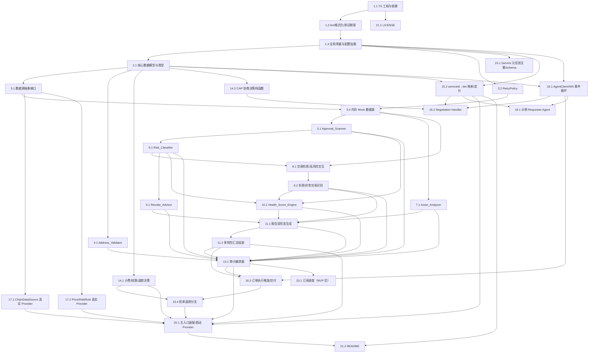

# Implementation Plan: 钱包风险体检 Agent（Wallet Risk Audit Agent）

## Overview

本计划将设计文档拆解为一系列可由代码生成 Agent 增量完成的编码任务。任务遵循「脚手架 → 数据模型 → 数据源抽象层 + RetryPolicy → 各分析模块（纯函数，PBT 优先）→ 编排器 → 报告生成 → CAP 适配层 / 支付结算网关 → 端到端装配与集成 → 开源交付物」的依赖顺序，确保每一步都建立在前序步骤之上，最终在端到端装配处把所有组件连成可运行的 CAP Provider，不留孤立代码。

实现语言：**Node.js + TypeScript**（依据 design.md 技术选型）。测试库：**Vitest** + **fast-check**（属性测试，每条属性 `numRuns ≥ 100`）。被审计链固定为 **Ethereum 主网**；CAP 订单结算固定在 **Base 网络的 USDC**，二者相互独立。

约定：
- 标注 `*` 的子任务为可选测试任务（属性测试 / 单元测试 / 集成测试），可在 MVP 中跳过；其余为核心实现任务，必须完成。顶层任务不标注 `*`。
- 每条属性测试以注释标注：`// Feature: wallet-risk-audit-agent, Property {number}: {property_text}`，并配置 `numRuns ≥ 100`。
- 分析模块均为纯函数，数据通过注入的数据源抽象接口提供，测试时用内存 Mock 驱动。
- 严格依据 `docs/cap-protocol.md` 使用真实 CAP SDK 方法，不臆造 API。

## Tasks

- [ ] 1. 项目脚手架与工程基础
  - [ ] 1.1 初始化 TypeScript 工程与依赖
    - 创建 `package.json`、`tsconfig.json`（strict 模式）、源码与测试目录结构（`src/`、`test/`）
    - 安装运行时依赖：`@croo-network/sdk`、`viem`；安装开发依赖：`typescript`、`vitest`、`fast-check`
    - 配置 `npm run build`（tsc）与 `npm run test`（`vitest --run`，单次执行而非 watch）脚本
    - _需求: 19.2_
  - [ ] 1.2 配置 lint、格式化与测试框架
    - 配置 ESLint + Prettier（或等价工具）与 `vitest.config.ts`
    - 验证 fast-check 可在 Vitest 中运行（一个最小通过用例）
    - _需求: 19.2_
  - [ ] 1.3 定义全局常量与配置加载骨架
    - 定义被审计链常量 `AUDITED_CHAIN = "Ethereum Mainnet"` 与结算链常量（Base）
    - 定义环境变量读取骨架：`CROO_API_URL`、`CROO_WS_URL`、`CROO_SDK_KEY`、可选 `rpcURL`，以及各数据源 / 价格源 / 规则库 API Key（仅从环境变量注入，不入库、不入日志）
    - _需求: 17.1, 19.2_

- [ ] 2. 核心数据模型与类型定义
  - [ ] 2.1 定义机器可读结构化类型
    - 在 `src/models/` 实现 `RiskLevel`、`Tier`、`ApprovalKind`、`ApprovalRecord`、`ContractRisk`、`AssetItem`、`AssetDistribution`、`TxFinding`、`RevokeAdvice`、`RevokeLink`、`ModuleStatus`、`AuditReportStructured`、`MultiWalletReport`、`OrderContext`、`SettlementRecord` 等类型
    - `AuditReportStructured` 必含 `schemaVersion`、`riskLevelSummary`、`scoredOnIncompleteData`、`readOnlyDeclaration`、`auditedChain`
    - 明确约束：对外接口与持久化模型 schema 中不存在私钥 / 助记词 / 已签名交易字段
    - _需求: 13.2, 14.7, 17.1_

- [ ] 3. 数据源抽象层与 RetryPolicy
  - [ ] 3.1 定义数据源抽象接口
    - 在 `src/datasource/` 定义 `ChainDataSource`（`getApprovals` / `getTransactions` / `getInternalTxs` / `getBalances` / `getContractMeta`）、`PriceDataSource`（`getUsdPrices`，含来源名与取价时间）、`RiskRuleSource`（`lookup`）三个只读接口
    - 接口仅暴露只读 `get*` / `lookup` 方法，确保架构上无写链路径
    - _需求: 6.1, 13.1, 18.3_
  - [ ] 3.2 实现 RetryPolicy
    - 实现 `RetryPolicy.run`：单次请求 10 秒超时；失败后最多重试 3 次（含首次共 4 次尝试）；全失败抛 `DataSourceUnavailable(sourceName)`
    - _需求: 18.1, 18.2_
  - [ ]* 3.3 为 RetryPolicy 编写属性测试
    - fast-check（numRuns ≥ 100），注释 `// Feature: wallet-risk-audit-agent, Property 27: ...`
    - **Property 27: 数据获取重试上限**（对会在第 k 次成功或始终失败的调用，总尝试次数 = min(k, 4) 且不超过 4 次；4 次均失败时标记暂不可用并产生“数据可能不完整”提示）
    - _需求: 18.1, 18.2_ _设计属性: Property 27_
  - [ ] 3.4 实现内存 Mock 数据源
    - 实现 `ChainDataSource` / `PriceDataSource` / `RiskRuleSource` 的内存 Mock（可注入预置数据与可控失败/超时），供各分析模块与端到端测试驱动
    - _需求: 18.3_

- [ ] 4. 实现 Address_Validator（地址校验，纯逻辑）
  - [ ] 4.1 实现地址校验与批量 / 去重 / 上限 / 网络判定
    - 校验 `^0x[0-9a-fA-F]{40}$`（大小写不敏感，全小写 / 全大写 / EIP-55 校验和形式均有效）；空 / 空白 / 缺失拒绝并指明原因；逐地址独立校验并去重保留一个；单次 > 50 个拒绝；非 Ethereum 网络返回“暂不支持该网络”；通过者标记为待分析地址
    - _需求: 1.1, 1.2, 1.3, 1.4, 1.5, 1.6, 1.7, 17.2_
  - [ ]* 4.2 编写地址格式校验属性测试
    - fast-check（numRuns ≥ 100，地址生成器覆盖全小写 / 全大写 / EIP-55 + 各类非法形态），注释 `// Feature: wallet-risk-audit-agent, Property 1: ...`
    - **Property 1: 地址格式校验正确性**
    - _需求: 1.1, 1.2, 1.4_ _设计属性: Property 1_
  - [ ]* 4.3 编写批量校验与去重幂等属性测试
    - fast-check（numRuns ≥ 100），注释 `// Feature: wallet-risk-audit-agent, Property 2: ...`
    - **Property 2: 批量校验等价于逐个校验且去重幂等**
    - _需求: 1.5, 1.7_ _设计属性: Property 2_
  - [ ]* 4.4 编写边界单元测试
    - 覆盖空白地址（1.3）、超过 50 个地址（1.6）、非 Ethereum 网络提示（17.2）
    - _需求: 1.3, 1.6, 17.2_

- [ ] 5. 实现 Approval_Scanner（授权扫描，纯逻辑）
  - [ ] 5.1 实现授权扫描与无限授权判定
    - 通过注入的 `ChainDataSource` 扫描 ERC-20 allowance、ERC-721 / ERC-1155 `setApprovalForAll`、Permit2 授权
    - ERC-20 allowance ≥ 2^255 或 `setApprovalForAll == true` 判定为 `Unlimited_Approval`；每条列出代币合约、被授权方、可读标签（无标签 = “未知”）、最近更新时间戳
    - 无授权返回“无授权记录”；数据源超时 / 不可用返回失败结果，且保留该地址上一次成功扫描数据不被覆盖
    - _需求: 6.1, 6.2, 6.3, 6.4, 6.5, 6.6_
  - [ ]* 5.2 编写无限授权判定属性测试
    - fast-check（numRuns ≥ 100，allowance 生成器重点采样 2^255 边界），注释 `// Feature: wallet-risk-audit-agent, Property 4: ...`
    - **Property 4: 无限授权判定**
    - _需求: 6.2, 6.3_ _设计属性: Property 4_
  - [ ]* 5.3 编写授权记录字段完整性属性测试
    - fast-check（numRuns ≥ 100），注释 `// Feature: wallet-risk-audit-agent, Property 5: ...`
    - **Property 5: 授权记录字段完整性**
    - _需求: 6.4_ _设计属性: Property 5_
  - [ ]* 5.4 编写无授权记录单元测试
    - 覆盖“无授权记录”结果（6.5）
    - _需求: 6.5_

- [ ] 6. 实现 Risk_Classifier（风险分类，纯逻辑）
  - [ ] 6.1 实现可疑 / 高风险合约分类与失败保留逻辑
    - 通过注入的 `RiskRuleSource` 与 `ContractMeta` 判定 6 项可疑特征：(a) 未开源 (b) 部署 < 30 天 (c) 历史交易 < 100 (d) 无审计 (e) 命中黑名单 (f) spender 为 EOA
    - 命中恰 1 项 → `Suspicious_Contract`；命中 ≥ 2 项 → 升级为 `High_Risk_Contract`；为每个被授权合约赋予合法 `Risk_Level`，并列出全部命中特征作为原因
    - 规则库不可达时返回不可用结果、不输出本次分类，并保留上一次成功分类不被覆盖
    - _需求: 7.1, 7.2, 7.3, 7.4, 7.5, 7.6_
  - [ ]* 6.2 编写分级与原因属性测试
    - fast-check（numRuns ≥ 100，6 项布尔特征全组合子集生成器），注释 `// Feature: wallet-risk-audit-agent, Property 6: ...`
    - **Property 6: 可疑 / 高风险合约分级与原因**
    - _需求: 7.1, 7.2, 7.3, 7.4, 7.5_ _设计属性: Property 6_
  - [ ]* 6.3 编写“失败不覆盖上次成功结果”属性测试
    - fast-check（numRuns ≥ 100），覆盖 Approval_Scanner 与 Risk_Classifier 两处缓存保留行为，注释 `// Feature: wallet-risk-audit-agent, Property 7: ...`
    - **Property 7: 数据源 / 规则库失败不覆盖上次成功结果**
    - _需求: 6.6, 7.6_ _设计属性: Property 7_

- [ ] 7. 实现 Asset_Analyzer（资产分布，纯逻辑）
  - [ ] 7.1 实现资产分布汇总
    - 汇总原生代币 + ERC-20（不含 NFT），通过注入的 `PriceDataSource` 估值；按 USD 降序取 Top 10，其余并入“其他”；各项与“其他”百分比保留两位小数、合计 100.00%
    - 标注单位 USD、价格来源名与取价时间；无法估值标“估值不可用”且排除出总值与百分比；< $1 的 ERC-20 视为垃圾代币归入“其他”；无 ≥ $1 资产返回“无可显示资产”
    - _需求: 9.1, 9.2, 9.3, 9.4, 9.5, 9.6_
  - [ ]* 7.2 编写资产分布不变量属性测试
    - fast-check（numRuns ≥ 100），注释 `// Feature: wallet-risk-audit-agent, Property 12: ...`
    - **Property 12: 资产分布不变量**
    - _需求: 9.1, 9.2, 9.3, 9.4, 9.5_ _设计属性: Property 12_
  - [ ]* 7.3 编写资产边界单元测试
    - 覆盖“无可显示资产”（9.6）与“估值不可用”排除逻辑（9.4）
    - _需求: 9.4, 9.6_

- [ ] 8. 实现 Transaction_Analyzer（交易分析，纯逻辑）
  - [ ] 8.1 实现交易检索与高风险交互检测
    - 通过注入的 `ChainDataSource` 检索默认 90 天（可配 1–365）窗口内最多 1,000 笔交易及内部调用
    - 直接交互对象命中 `High_Risk_Contract` → 标记高风险交互、类型“直接交互”；内部调用命中 → 类型“内部调用”；按时间从新到旧列出至多 100 笔（hash / 合约 / UTC 时间 / 类型）；以天标明窗口长度；无命中返回“未发现高风险合约交互”
    - 地址格式无效时拒绝并返回错误结果、不返回任何交易数据；数据源不可用返回检索失败提示
    - _需求: 8.1, 8.2, 8.3, 8.4, 8.5, 8.6, 10.5, 10.6_
  - [ ] 8.2 实现失败交易与异常交易识别
    - 链上回滚状态识别为失败交易；识别 5 类异常：(a) 粉尘 < $1 (b) 零金额且对方地址与历史交互地址首尾 4 字符均相同的地址投毒 (c) 向风险名单地址转出 (d) 失败交易 Gas > 窗口内失败交易 Gas 中位数 3 倍 (e) 与部署 < 7 天合约交互
    - 按时间从新到旧列出每笔失败 / 异常交易的 hash、UTC 时间、被标记原因；无命中返回“未发现失败或异常交易”
    - _需求: 10.1, 10.2, 10.3, 10.4_
  - [ ]* 8.3 编写高风险交互属性测试
    - fast-check（numRuns ≥ 100），注释 `// Feature: wallet-risk-audit-agent, Property 8: ...`
    - **Property 8: 高风险交互标记与交互类型**
    - _需求: 8.2, 8.3_ _设计属性: Property 8_
  - [ ]* 8.4 编写窗口 / 上限 / 排序 / 字段属性测试
    - fast-check（numRuns ≥ 100），注释 `// Feature: wallet-risk-audit-agent, Property 9: ...`
    - **Property 9: 交易窗口、上限、排序与字段完整性**
    - _需求: 8.1, 8.4, 10.3_ _设计属性: Property 9_
  - [ ]* 8.5 编写失败 / 异常交易识别属性测试
    - fast-check（numRuns ≥ 100，五类异常各构造命中 / 不命中样本，地址投毒构造首尾 4 字符相同对照），注释 `// Feature: wallet-risk-audit-agent, Property 10: ...`
    - **Property 10: 失败与异常交易识别**
    - _需求: 10.1, 10.2_ _设计属性: Property 10_
  - [ ]* 8.6 编写无效地址拒绝属性测试
    - fast-check（numRuns ≥ 100），注释 `// Feature: wallet-risk-audit-agent, Property 11: ...`
    - **Property 11: 交易分析拒绝无效地址**
    - _需求: 10.5_ _设计属性: Property 11_
  - [ ]* 8.7 编写无命中单元测试
    - 覆盖“未发现高风险合约交互”（8.6）与“未发现失败或异常交易”（10.4）
    - _需求: 8.6, 10.4_

- [ ] 9. 实现 Revoke_Advisor（撤销建议，纯逻辑）
  - [ ] 9.1 实现撤销建议生成、排序与链接
    - 为每个 `Unlimited_Approval` / `Suspicious_Contract` / `High_Risk_Contract` 各生成一条建议与 `Revoke_Link`（含被授权合约地址、代币合约地址、链参数 `ethereum-mainnet`）
    - 排序固定 CRITICAL→HIGH→MEDIUM→LOW，同级按授权额度降序；每条标注类别 + Risk_Level 作为原因；ERC-721 `setApprovalForAll` 以操作员地址 + NFT 合约地址为参数；无可撤销返回“无需撤销的授权”且不生成链接
    - 仅产出链接、不广播交易、不含私钥 / 助记词 / 已签名交易字段
    - _需求: 11.1, 11.2, 11.3, 11.4, 11.5, 11.6, 13.3_
  - [ ]* 9.2 编写建议一一对应与链接完整性属性测试
    - fast-check（numRuns ≥ 100），注释 `// Feature: wallet-risk-audit-agent, Property 13: ...`
    - **Property 13: 撤销建议一一对应且链接完整**
    - _需求: 11.1, 11.2, 11.4_ _设计属性: Property 13_
  - [ ]* 9.3 编写撤销建议排序属性测试
    - fast-check（numRuns ≥ 100），注释 `// Feature: wallet-risk-audit-agent, Property 14: ...`
    - **Property 14: 撤销建议排序**
    - _需求: 11.3_ _设计属性: Property 14_
  - [ ]* 9.4 编写 NFT 操作员授权链接属性测试
    - fast-check（numRuns ≥ 100），注释 `// Feature: wallet-risk-audit-agent, Property 15: ...`
    - **Property 15: NFT 操作员授权撤销链接**
    - _需求: 11.5_ _设计属性: Property 15_
  - [ ]* 9.5 编写只读不含敏感字段属性测试
    - fast-check（numRuns ≥ 100），断言输出仅含 Revoke_Link、不含已签名交易 / 私钥 / 助记词字段、不触发交易广播，注释 `// Feature: wallet-risk-audit-agent, Property 24: ...`
    - **Property 24: 撤销建议只读不含敏感字段**
    - _需求: 13.3_ _设计属性: Property 24_
  - [ ]* 9.6 编写无需撤销单元测试
    - 覆盖“无需撤销的授权”（11.6）
    - _需求: 11.6_

- [ ] 10. 实现 Health_Score_Engine（健康评分，纯逻辑）
  - [ ] 10.1 实现加性扣分评分、等级映射与扣分明细
    - 实现纯加性扣分函数：`weight(CRITICAL=40, HIGH=25, MEDIUM=12, LOW=4)`，`Health_Score = max(0, 100 - Σweight)`；先对风险项规范排序后求和以保证顺序无关
    - 列出每个风险项及扣分贡献并降序排序；无风险 → 100（落入 80–100）；等级映射 80–100 优 / 60–79 良 / 40–59 中 / 0–39 差；仅按已完成模块计算并在不完整数据时标注 `scoredOnIncompleteData = true`
    - _需求: 12.1, 12.2, 12.3, 12.4, 12.5, 12.6, 12.7_
  - [ ]* 10.2 编写评分取值范围属性测试
    - fast-check（numRuns ≥ 100），注释 `// Feature: wallet-risk-audit-agent, Property 16: ...`
    - **Property 16: 健康评分取值范围**
    - _需求: 12.1, 12.3_ _设计属性: Property 16_
  - [ ]* 10.3 编写评分确定性属性测试
    - fast-check（numRuns ≥ 100，含集合置换不变性），注释 `// Feature: wallet-risk-audit-agent, Property 17: ...`
    - **Property 17: 健康评分确定性**
    - _需求: 12.4_ _设计属性: Property 17_
  - [ ]* 10.4 编写评分单调性属性测试
    - fast-check（numRuns ≥ 100，构造超集与等级提升对照），注释 `// Feature: wallet-risk-audit-agent, Property 18: ...`
    - **Property 18: 健康评分单调性**
    - _需求: 12.5_ _设计属性: Property 18_
  - [ ]* 10.5 编写等级映射属性测试
    - fast-check（numRuns ≥ 100），注释 `// Feature: wallet-risk-audit-agent, Property 19: ...`
    - **Property 19: 健康评分等级映射**
    - _需求: 12.6_ _设计属性: Property 19_
  - [ ]* 10.6 编写不完整数据评分属性测试
    - fast-check（numRuns ≥ 100），注释 `// Feature: wallet-risk-audit-agent, Property 20: ...`
    - **Property 20: 不完整数据下的评分**
    - _需求: 12.7_ _设计属性: Property 20_
  - [ ]* 10.7 编写扣分明细覆盖与排序属性测试
    - fast-check（numRuns ≥ 100），注释 `// Feature: wallet-risk-audit-agent, Property 21: ...`
    - **Property 21: 扣分明细覆盖与排序**
    - _需求: 12.2_ _设计属性: Property 21_

- [ ] 11. 实现 Report_Generator（报告生成，纯逻辑）
  - [ ] 11.1 实现报告双形态生成与档位裁剪
    - 汇总各模块结果输出人类可读形式（Markdown）与机器可读结构化形式（JSON）；结构化形式含 `schemaVersion`、`riskLevelSummary`、`healthScore`、`walletAddress`、`auditedChain`（Ethereum Mainnet）、UTC 生成时间与 `readOnlyDeclaration`
    - Quick 档仅含 Health_Score + Unlimited_Approval + High_Risk_Contract（Full 档子集）；Full 档含全部模块结果；即使地址校验失败仍标注当前支持的 Audited_Chain 名称
    - _需求: 2.4, 5.1, 5.2, 13.4, 14.2, 14.3, 14.4, 14.5, 14.6, 14.7, 17.3_
  - [ ] 11.2 实现多钱包汇总报告组装
    - 接受一组子报告组装为 `MultiWalletReport`，标明钱包数量（`walletCount`）等于子报告数量（更长历史窗口的选择由编排器在任务 13 决定并下传）
    - _需求: 15.1, 15.3, 15.4_
  - [ ]* 11.3 编写报告结构不变量与档位裁剪属性测试
    - fast-check（numRuns ≥ 100），注释 `// Feature: wallet-risk-audit-agent, Property 22: ...`
    - **Property 22: 报告结构不变量与档位裁剪**
    - _需求: 2.4, 5.1, 5.2, 13.4, 14.2, 14.3, 14.4, 14.5, 14.6, 14.7, 17.3_ _设计属性: Property 22_
  - [ ]* 11.4 编写报告序列化往返属性测试
    - fast-check（numRuns ≥ 100），注释 `// Feature: wallet-risk-audit-agent, Property 23: ...`
    - **Property 23: 报告序列化往返**
    - _需求: 14.6, 14.7_ _设计属性: Property 23_
  - [ ]* 11.5 编写只读声明与无敏感字段单元测试
    - 断言报告含只读声明、结构化模型不含私钥 / 助记词字段、不向未声明第三方转交请求数据
    - _需求: 5.3, 13.2, 13.4, 13.5_

- [ ] 12. 检查点 — 确保分析模块全部测试通过
  - Ensure all tests pass, ask the user if questions arise.（确保所有测试通过，如有疑问请询问用户。）

- [ ] 13. 实现 Audit Orchestrator（审计编排器）
  - [ ] 13.1 实现档位路由、并发调度、多钱包扇出与部分成功聚合
    - 按订单档位（Quick / Full / Multi）决定调用的模块集合并发调度；Multi 档对去重后的每个有效地址扇出审计、采用严格大于 Quick / Full 默认窗口的更长历史窗口，并调用任务 11 的多钱包组装
    - 收集各模块 `ModuleStatus`（OK / INCOMPLETE / FAILED）；捕获 `DataSourceUnavailable`，将依赖该数据源的模块标记 `INCOMPLETE` / `FAILED` 并记录 `unavailableSource`；把状态传播给 Report_Generator 与 Payment_Gateway
    - _需求: 2.3, 14.1, 15.1, 15.2, 18.3, 18.4, 18.5_
  - [ ]* 13.2 编写模块不完整状态传播属性测试
    - fast-check（numRuns ≥ 100），注释 `// Feature: wallet-risk-audit-agent, Property 28: ...`
    - **Property 28: 模块不完整状态传播**
    - _需求: 18.3_ _设计属性: Property 28_
  - [ ]* 13.3 编写多钱包覆盖与计数属性测试
    - fast-check（numRuns ≥ 100），注释 `// Feature: wallet-risk-audit-agent, Property 25: ...`
    - **Property 25: 多钱包报告覆盖与计数**
    - _需求: 15.1, 15.3, 15.4_ _设计属性: Property 25_
  - [ ]* 13.4 编写多钱包历史窗口属性测试
    - fast-check（numRuns ≥ 100），注释 `// Feature: wallet-risk-audit-agent, Property 26: ...`
    - **Property 26: 多钱包历史窗口更长**
    - _需求: 15.2_ _设计属性: Property 26_
  - [ ]* 13.5 编写档位触发模块集合单元测试
    - 在 mock 数据源下断言 Quick / Full / Multi 各档位触发正确的模块集合
    - _需求: 2.3, 14.1_

- [ ] 14. 实现 Payment_Gateway 计费 / 结算 / 退款决策与 CAP 协商决策纯函数
  - [ ] 14.1 实现计费、结算、退款决策与结算记录
    - 交付前要求 PayOrder 完成、USDC 在 CAPVault 锁定为 Escrow，否则拒绝交付；以 Base USDC 结算、gas 由平台代付
    - 至少一个模块成功 → 允许交付并按档位（0.5 / 2 / 5 USDC）足额结算；全失败 → 触发 RejectOrder 退款
    - 完成结算时记录档位、付款方地址、链上交易哈希到 `SettlementRecord`
    - _需求: 4.2, 4.3, 4.4, 4.5, 4.6, 4.7, 4.8, 4.9, 4.10, 4.11, 5.3, 18.4, 18.5_
  - [ ] 14.2 实现 CAP 协商决策纯函数
    - 实现纯函数 `decideNegotiation(serviceId, params)`：当且仅当 serviceId 属于本 Agent 已配置三档之一且必需参数完整时返回 `ACCEPT`，否则返回 `REJECT` 并附原因；供任务 16 Negotiation Handler 调用
    - _需求: 2.2, 2.6_
  - [ ]* 14.3 编写付费-交付与结算-退款不变量属性测试
    - fast-check（numRuns ≥ 100），注释 `// Feature: wallet-risk-audit-agent, Property 29: ...`
    - **Property 29: 付费-交付与结算-退款不变量**
    - _需求: 4.2, 4.9, 18.4, 18.5, 2.7_ _设计属性: Property 29_
  - [ ]* 14.4 编写结算记录完整性属性测试
    - fast-check（numRuns ≥ 100），注释 `// Feature: wallet-risk-audit-agent, Property 30: ...`
    - **Property 30: 结算记录完整性**
    - _需求: 4.10_ _设计属性: Property 30_
  - [ ]* 14.5 编写协商决策属性测试
    - fast-check（numRuns ≥ 100），注释 `// Feature: wallet-risk-audit-agent, Property 3: ...`
    - **Property 3: 协商决策正确性**
    - _需求: 2.2, 2.6_ _设计属性: Property 3_
  - [ ]* 14.6 编写档位价格表单元测试
    - 断言 Quick = 0.5 / Full = 2 / Multi = 5 USDC 三档定价
    - _需求: 4.4, 4.5, 4.6_

- [ ] 15. 实现 Service 元信息文案与运行配置（代码侧可完成部分，H1-3）
  - [ ] 15.1 在仓库维护三档 Service 元信息文案与交付 schema
    - 在仓库内维护 Quick / Full / Multi 三档的 Service 描述、1–5 个 Skill_Tags、输入参数说明与结构化交付 schema 文案（供人工填入 Dashboard）
    - _需求: 2.5, 3.2_
  - [ ] 15.2 实现 serviceId→tier 映射与档位定价 / Service_ID 配置
    - 实现从环境变量注入的 `SERVICE_ID_QUICK` / `SERVICE_ID_FULL` / `SERVICE_ID_MULTI` 到 `Tier` 的映射表；定义档位定价 0.5 / 2 / 5 USDC 与 Service_ID 暴露
    - 外部前置：运行时所注入的 Service_ID 由人工在 Dashboard 配置 Service 后产出（见末尾「人工介入前置条件」），代码侧仅负责映射与读取
    - _需求: 3.3, 4.1_

- [ ] 16. 实现 CAP 适配层（Provider）
  - [ ] 16.1 实现 AgentClient 初始化与 WebSocket 事件循环
    - 用 `X-SDK-Key` 初始化 `AgentClient`；通过 `connectWebSocket` 建立并维持事件连接（依赖 SDK 指数退避自动重连 1s→30s 与 30s 心跳）；把 `negotiation_created` / `order_created` / `order_paid` / `order_rejected` / `order_expired` 路由到对应处理器
    - 外部前置：运行需注入人工注册产出的 `CROO_SDK_KEY`（见末尾「人工介入前置条件」）
    - _需求: 2.1_
  - [ ] 16.2 实现 Negotiation Handler（接受 / 拒绝协商）
    - 收到 `negotiation_created`：调用任务 14 的协商决策纯函数，`ACCEPT` → `AcceptNegotiation`；`REJECT` → `RejectNegotiation`（带原因）
    - _需求: 2.2, 2.6_
  - [ ] 16.3 实现订单执行触发与交付（DeliverOrder / UploadFile）
    - 收到 `order_paid` → 取出 Wallet_Address 与档位 → 调用编排器执行审计 → `DeliverOrder` 交付 text + schema（大报告 / 多钱包先 `UploadFile` 取 objectKey 再带入交付数据）
    - 用 `APIError` + `isNotFound` / `isUnauthorized` / `isInsufficientBalance` 分类错误；依赖 SDK 幂等保护安全重试
    - _需求: 2.3, 2.4, 5.4, 14.1_
  - [ ] 16.4 实现拒单退款分支（RejectOrder）
    - 已支付订单缺少必需参数 → `RejectOrder(reason)`；全部数据源失败且无任何模块成功 → `RejectOrder(reason="数据不可用")`，触发 CAPVault Escrow 退款
    - _需求: 2.7, 18.5_
  - [ ]* 16.5 编写 CAP 事件路由集成测试
    - 在 mock SDK 下断言事件路由与协商 / 交付 / 拒单分支正确触发
    - _需求: 2.1, 5.4_

- [ ] 17. 数据源真实 Provider 接入（Ethereum 主网，只读）
  - [ ] 17.1 实现 ChainDataSource 真实 Provider
    - 用 `viem`（只读 RPC / 合约调用）+ Alchemy / Etherscan REST 实现 `getApprovals` / `getTransactions` / `getInternalTxs` / `getBalances` / `getContractMeta`，经 `RetryPolicy` 调用；仅只读，无 `eth_sendRawTransaction` 路径
    - 外部前置：运行需注入人工申请的 Alchemy / Etherscan API Key（见末尾「人工介入前置条件」）
    - _需求: 6.1, 8.1, 9.1, 13.1_
  - [ ] 17.2 实现 PriceDataSource 与 RiskRuleSource 真实 Provider
    - 用 CoinGecko 实现 `PriceDataSource.getUsdPrices`（返回来源名与取价时间）；用规则库 / 社区黑名单实现 `RiskRuleSource.lookup`（黑名单 / 钓鱼 / 盗币标记 + 可读标签），均经 `RetryPolicy` 调用
    - 外部前置：运行需注入人工申请的 CoinGecko API Key（见末尾「人工介入前置条件」）
    - _需求: 7.2, 9.3_
  - [ ]* 17.3 编写数据源 Provider 连通与字段映射集成测试
    - 针对若干已知真实 Ethereum 地址 + mock / 录制响应，断言各 Provider 连通与字段映射正确
    - _需求: 6.1, 7.2, 9.1_

- [ ] 18. 检查点 — 确保编排器、计费、CAP 适配层与数据源测试通过
  - Ensure all tests pass, ask the user if questions arise.（确保所有测试通过，如有疑问请询问用户。）

- [ ] 19. 实现示例 Requester Agent（A2A 调用链演示）
  - [ ] 19.1 实现示例 Requester
    - 实现 `NegotiateOrder`（指定 Service_ID）→ `PayOrder` → `GetDelivery` 调用链，演示本 Agent 被其他 Agent 作为依赖雇用，并消费结构化结果中的 `Risk_Level` / `Health_Score`
    - _需求: 5.1, 5.2, 5.4_

- [ ] 20. 端到端装配与启动 Provider
  - [ ] 20.1 实现主入口装配
    - 在 `src/main.ts`（或等价入口）把配置加载、数据源真实 Provider（任务 17）、编排器、报告生成、CAP 适配层与支付网关连接为可运行的 Provider 事件循环；出站请求限定在配置的 Provider 白名单内
    - 外部前置：启动需注入人工产出的 `CROO_SDK_KEY` 与 `SERVICE_ID_QUICK/FULL/MULTI`（见末尾「人工介入前置条件」）
    - _需求: 2.1, 2.3, 13.5, 18.4_
  - [ ]* 20.2 编写端到端集成测试
    - 在 mock 数据源 + mock SDK 下跑通 Negotiate→Pay→执行审计→Deliver→结算 / 退款全流程；对若干已知真实 Ethereum 地址（含已知无限授权 / 已知钓鱼合约交互）做回归断言
    - _需求: 2.3, 4.8, 6.1, 18.4_

- [ ] 21. 开源交付物（代码侧可完成部分，H4-1 / H4-2）
  - [ ] 21.1 添加开源许可证
    - 在仓库根目录放置 MIT 或 Apache 2.0 LICENSE
    - _需求: 19.1_
  - [ ] 21.2 编写 README
    - 记录环境搭建步骤、所需环境变量（`CROO_API_URL`、`CROO_WS_URL`、`CROO_SDK_KEY` 及可选 `rpcURL`）、所用 CAP SDK 方法清单（至少 `AcceptNegotiation`、`RejectNegotiation`、`DeliverOrder`、`UploadFile`、`RejectOrder`、`connectWebSocket`）与 CAP 集成说明
    - 说明如何通过 CAP 调用本 Agent（含各档位 Service_ID 获取方式）以及各付费档位与 USDC 价格
    - _需求: 19.2, 19.3, 19.5_

- [ ] 22. 最终检查点 — 确保全部测试通过
  - Ensure all tests pass, ask the user if questions arise.（确保所有测试通过，如有疑问请询问用户。）

- [ ] 23. （MVP 后扩展）实现 Monitoring_Scheduler（订阅式自动巡检）
  - [ ] 23.1 实现订阅调度与变更通知
    - 按日 / 周周期自动对订阅 Wallet_Address 发起体检；发现新增风险项推送通知，无新增按通知偏好决定是否推送；取消订阅后停止后续巡检
    - 说明：订阅式自动巡检（Req 16）超出 MVP 范围，整组可延后实现
    - _需求: 16.1, 16.2, 16.3, 16.4_
  - [ ]* 23.2 编写订阅调度单元测试
    - 覆盖周期触发、新增风险推送、取消后停止巡检
    - _需求: 16.1, 16.4_

## Notes

- 标注 `*` 的子任务为可选测试任务（属性测试 / 单元测试 / 集成测试），可在追求快速 MVP 时跳过；顶层任务不标注 `*`。
- 每个任务都引用了具体的需求条目以保证可追溯性，涉及正确性属性的测试任务额外标注 `_设计属性: Property N_`。
- 检查点（任务 12、18、22）用于增量验证，确保阶段性成果稳定。
- 属性测试覆盖纯逻辑的普适正确性（Property 1–30），单元测试覆盖具体示例、空集与边界，集成测试覆盖数据源与 CAP 外部行为。
- 任务 23（订阅式自动巡检，Req 16）超出 MVP 范围，作为单独分组，可整组延后。
- 严格依据 `docs/cap-protocol.md` 使用真实 CAP SDK 方法，不臆造 API。
- 编号锚点：任务 15 = Service 元信息文案与运行配置（注入 Service_ID）；任务 16 = CAP 适配层（依赖人工注册产出的 CROO_SDK_KEY）；任务 17 = 数据源真实 Provider 接入（依赖人工申请的数据源 API Key）；任务 20 = 端到端装配 / 启动 Provider（注入 Service_ID 与 CROO_SDK_KEY）。

## 需求 / 属性覆盖检查（核对表）

### 需求覆盖

| 需求 | 覆盖任务 |
|------|----------|
| 1 钱包地址输入与校验 | 4.1, 4.2, 4.3, 4.4 |
| 2 CAP 集成与可调用接口 | 11.1, 13.1, 14.2, 16.1, 16.2, 16.3, 16.4, 16.5, 20.1 |
| 3 Store 上架与可发现性（代码侧） | 15.1, 15.2（其余见人工介入清单） |
| 4 CAP 按次付费与链上结算 | 14.1, 14.3, 14.4, 14.6, 15.2 |
| 5 A2A 可组合性 | 11.1, 11.5, 14.1, 16.3, 19.1 |
| 6 无限授权检测 | 3.1, 5.1, 5.2, 5.3, 5.4, 6.3, 17.1 |
| 7 可疑合约授权识别 | 6.1, 6.2, 6.3, 17.2 |
| 8 高风险合约交互检测 | 8.1, 8.3, 8.4, 17.1 |
| 9 资产分布摘要 | 7.1, 7.2, 7.3, 17.2 |
| 10 失败 / 异常交易分析 | 8.1, 8.2, 8.5, 8.6, 8.7 |
| 11 撤销建议与撤销链接 | 9.1, 9.2, 9.3, 9.4, 9.6 |
| 12 钱包健康评分 | 10.1, 10.2, 10.3, 10.4, 10.5, 10.6, 10.7 |
| 13 只读安全边界与数据自主 | 2.1, 3.1, 9.1, 9.5, 11.1, 11.5, 17.1, 20.1 |
| 14 安全报告生成与输出 | 11.1, 11.3, 11.4, 16.3 |
| 15 多钱包与历史行为分析 | 11.2, 13.1, 13.3, 13.4 |
| 16 订阅式自动巡检（MVP 后） | 23.1, 23.2 |
| 17 MVP 单链审计范围 | 1.3, 15.2, 11.1, 11.3 |
| 18 数据获取异常处理 | 3.2, 3.3, 13.1, 13.2, 14.1, 14.3, 16.4, 17.1, 17.2, 20.2 |
| 19 开源与交付物（代码侧） | 1.1, 1.2, 1.3, 15.1, 21.1, 21.2（视频 / 提交见人工介入清单） |

### 属性覆盖

| 属性 | 覆盖任务 |
|------|----------|
| Property 1 地址格式校验 | 4.2 |
| Property 2 批量校验 / 去重幂等 | 4.3 |
| Property 3 协商决策 | 14.5 |
| Property 4 无限授权判定 | 5.2 |
| Property 5 授权字段完整性 | 5.3 |
| Property 6 合约分级与原因 | 6.2 |
| Property 7 失败不覆盖上次成功 | 6.3 |
| Property 8 高风险交互与类型 | 8.3 |
| Property 9 窗口 / 上限 / 排序 / 字段 | 8.4 |
| Property 10 失败 / 异常交易识别 | 8.5 |
| Property 11 交易分析拒绝无效地址 | 8.6 |
| Property 12 资产分布不变量 | 7.2 |
| Property 13 撤销建议一一对应 / 链接完整 | 9.2 |
| Property 14 撤销建议排序 | 9.3 |
| Property 15 NFT 操作员授权链接 | 9.4 |
| Property 16 评分取值范围 | 10.2 |
| Property 17 评分确定性 | 10.3 |
| Property 18 评分单调性 | 10.4 |
| Property 19 等级映射 | 10.5 |
| Property 20 不完整数据评分 | 10.6 |
| Property 21 扣分明细覆盖 / 排序 | 10.7 |
| Property 22 报告结构不变量 / 档位裁剪 | 11.3 |
| Property 23 报告序列化往返 | 11.4 |
| Property 24 撤销只读不含敏感字段 | 9.5 |
| Property 25 多钱包覆盖与计数 | 13.3 |
| Property 26 多钱包历史窗口更长 | 13.4 |
| Property 27 数据获取重试上限 | 3.3 |
| Property 28 模块不完整状态传播 | 13.2 |
| Property 29 付费-交付 / 结算-退款不变量 | 14.3 |
| Property 30 结算记录完整性 | 14.4 |

## 人工介入前置条件（非编码任务，提交前完成）

> 以下项无法由代码完成，需在部署 / 提交前人工操作，并将产出的标识符注入运行配置（环境变量）。此处仅作提醒清单，不属于可执行编码任务，不编号、不加复选框。
>
> 与编码任务的衔接：注册产出的 `CROO_SDK_KEY` 是任务 16（CAP 适配层）与任务 20（启动 Provider）的运行前置；Dashboard 配置 Service 产出的 `SERVICE_ID_QUICK/FULL/MULTI` 注入任务 15 的运行配置、并为任务 20 端到端装配所需；数据源 / 价格源 API Key 是任务 17（数据源真实 Provider 接入）的运行前置。

- 注册 Agent（在 agent.croo.network 注册，获得 Agent_DID、CROO_SDK_KEY（仅显示一次需妥善保存）、AA_Wallet 地址）—— H1-1
- 在 Dashboard 配置 3 个 Service（Quick/Full/Multi 三档的描述、Skill_Tags、价格、SLA、交付 schema），获取 SERVICE_ID_QUICK/FULL/MULTI 并注入配置 —— H1-2、H6-1
- 在 Store 检索确认条目可被发现（可发现性人工校验）—— H1-4
- 申请数据 / 价格源 API Key（Alchemy / Etherscan / CoinGecko 注册），注入环境变量 —— H7-12
- 真实 USDC 端到端付费结算验证（注册第二个 Requester Agent、向 AA 钱包充值真实 Base USDC、人工跑通 Negotiate→Pay→Deliver→结算全流程）—— H2-7
- 触达真实交易对手与买家钱包以满足奖励资格门槛（≥3 个独立交易对手 Agent、≥5 个独立买家钱包，禁止自我刷单）—— H3-3
- 创建并公开 GitHub 仓库（设为公开可见）—— H4-3
- 录制 ≤5 分钟 Demo 视频 —— H4-4
- 在 DoraHacks 填写并提交 BUIDL（附仓库与视频链接）—— H4-5

## Task Dependency Graph

> 任务依赖图。下方先以 mermaid flowchart 展示核心实现叶子任务之间的依赖顺序（带 `*` 的可选测试任务紧随其父实现任务执行，未在 mermaid 图中单列）；随后以 JSON 执行波次（waves）覆盖全部叶子任务（含可选测试任务）供并行调度。同一波次内任务相互独立、可并行；波次 N 的任务在波次 0..N-1 全部完成后才可执行。



```json
{
  "waves": [
    { "id": 0, "tasks": ["1.1"] },
    { "id": 1, "tasks": ["1.2"] },
    { "id": 2, "tasks": ["1.3"] },
    { "id": 3, "tasks": ["2.1", "15.1", "21.1"] },
    { "id": 4, "tasks": ["3.1", "3.2", "4.1", "14.1", "14.2", "15.2"] },
    { "id": 5, "tasks": ["3.3", "3.4", "4.2", "4.3", "4.4", "14.3", "14.4", "14.5", "14.6", "16.1", "17.1", "17.2"] },
    { "id": 6, "tasks": ["5.1", "7.1", "16.2", "17.3", "19.1"] },
    { "id": 7, "tasks": ["5.2", "5.3", "5.4", "6.1", "7.2", "7.3"] },
    { "id": 8, "tasks": ["6.2", "6.3", "8.1", "9.1"] },
    { "id": 9, "tasks": ["8.2", "8.3", "8.4", "9.2", "9.3", "9.4", "9.5", "9.6"] },
    { "id": 10, "tasks": ["8.5", "8.6", "8.7", "10.1"] },
    { "id": 11, "tasks": ["10.2", "10.3", "10.4", "10.5", "10.6", "10.7", "11.1"] },
    { "id": 12, "tasks": ["11.2", "11.3", "11.4", "11.5"] },
    { "id": 13, "tasks": ["13.1"] },
    { "id": 14, "tasks": ["13.2", "13.3", "13.4", "13.5", "16.3"] },
    { "id": 15, "tasks": ["16.4"] },
    { "id": 16, "tasks": ["16.5", "20.1", "23.1"] },
    { "id": 17, "tasks": ["20.2", "21.2", "23.2"] }
  ]
}
```
